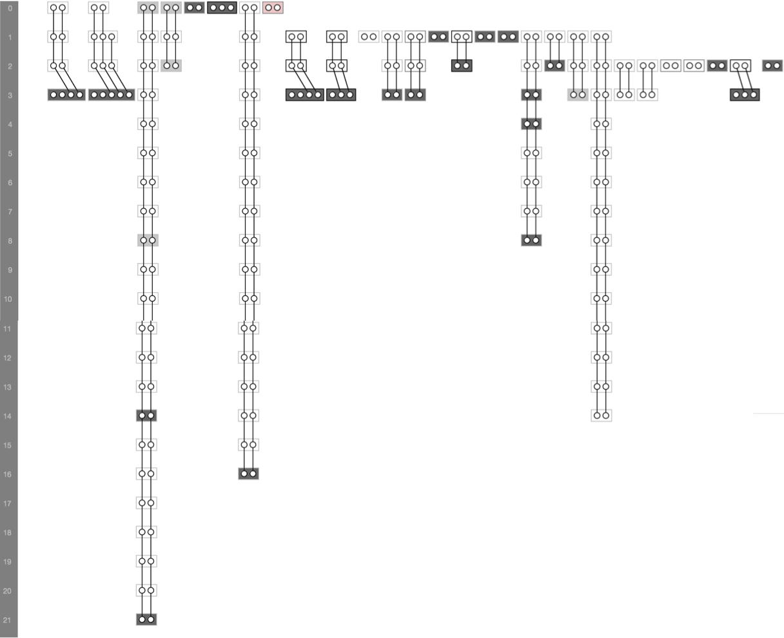

# An Appendix for "Studying the life expectancy of clone genealogies"
Patanamon Thongtanunam · Weiyi Shang · Ahmed E. Hassan
Under review

## Replication Package
### Tools
This study uses the following tools:
1. iClones: http://www.softwareclones.org/iclones.php
2. Understand: https://scitools.com/features/
3. Kenja Historage: https://github.com/niyaton/kenja/

### Scripts
1. extractVersions.sh 
    * This script downloads the source files (only .java) of each release from Git and store them in the ```<project>_versions/``` directory. Each directory is for one release. The directory name is created to be consistent with the lexicographically sorting.
    * This script also creates the ```changes``` file (i.e., change information that iClones need) in the directory of each release.
    * This script also provide a list of commits that associate with each release
        * Output : Java source files in each version in ```<project>_versions/```  and ```<project>.tag_commits.csv``` 
    * iClones will detect clone genealogies using files and versions in the ```<project>_versions/``` directory and produce an RCF file.  

2. classifier_experiment.R
	* This script run an experiment for our classifiers using random forest, SVN, or logistic regression techniques.
	* This script also measure the performance of classifiers (i.e., AUC, true positive, and false positive) while using the out-of-sample bootstrap validation technique.
	* The set of variable importance are also exported.

### Clone Genealogies
The clone genealogies in RCF files in this work can be visualized using the cyclone tool (http://www.softwareclones.org/cyclone.php). Below is an example of clone genealogies in Ant.

